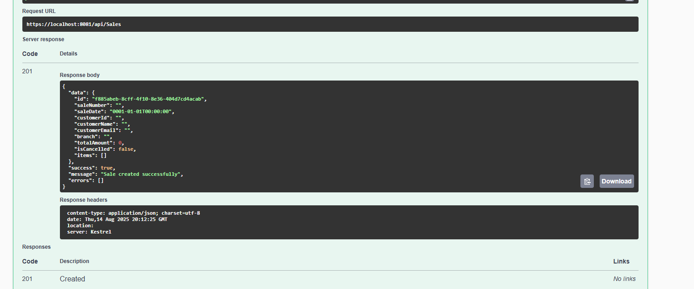
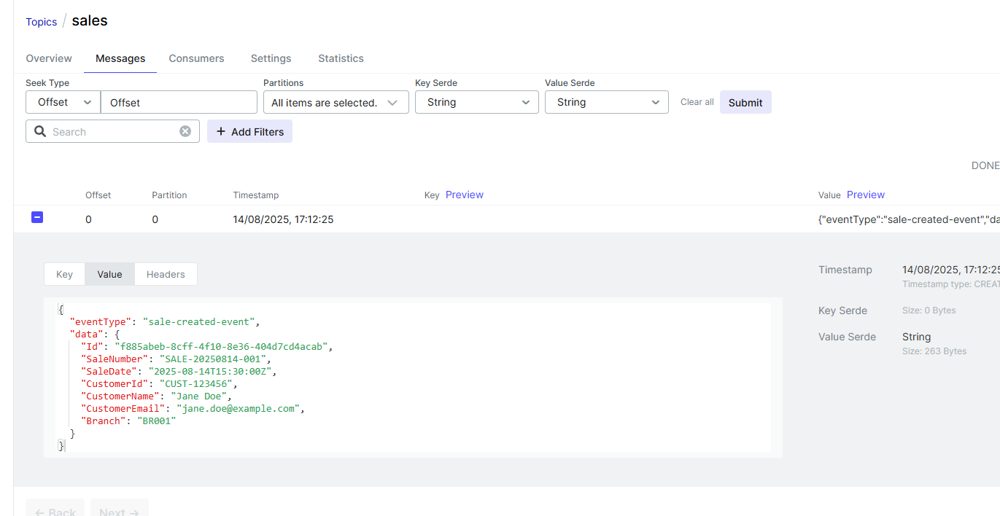
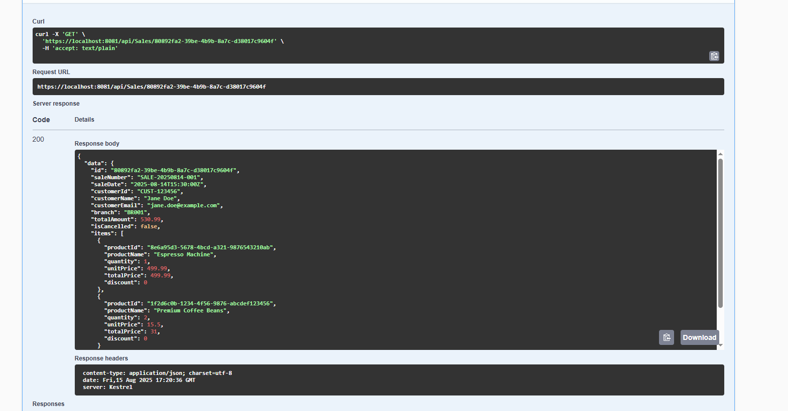
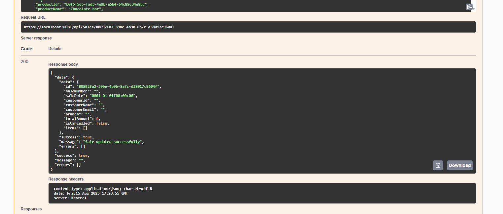
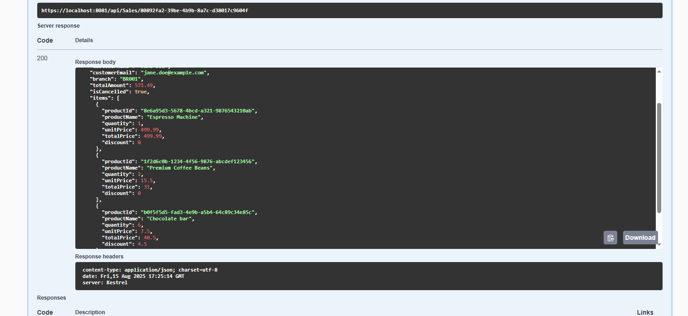
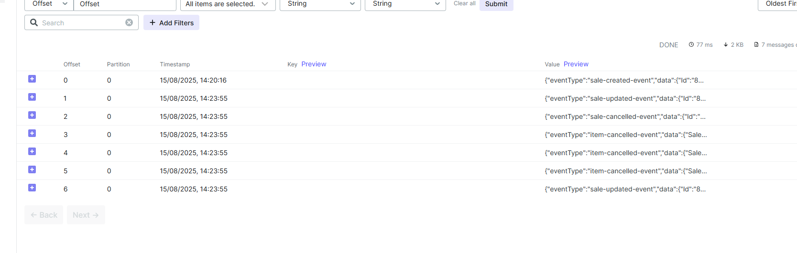
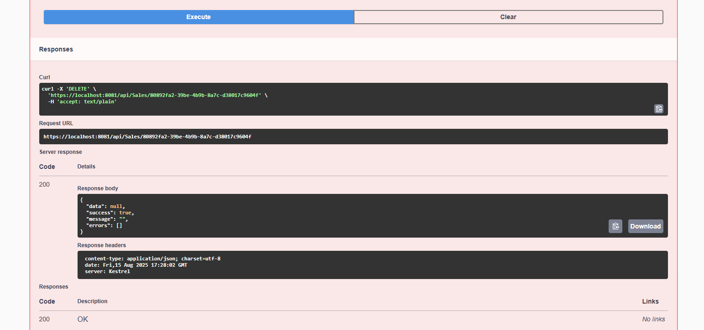
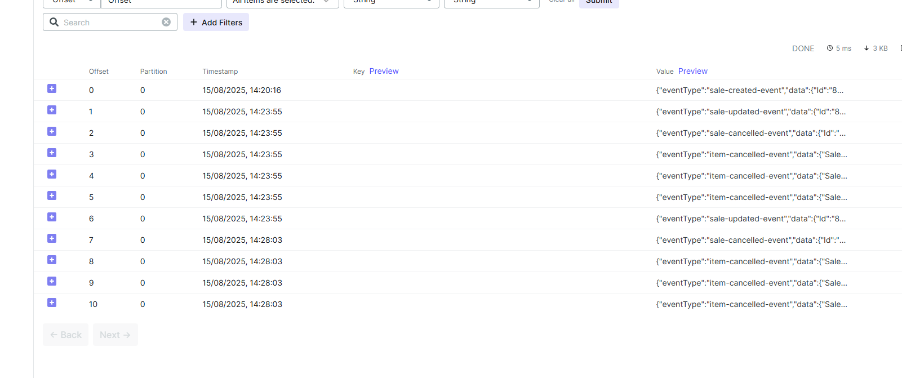

# 🛠️ Mouts Sales API

API for Sales and Items

## ⚙️ Prerequisites

Before you start, ensure you have installed:
- [.NET 8 SDK](https://dotnet.microsoft.com/en-us/download)
- [Docker Desktop](https://www.docker.com/products/docker-desktop)
- [Git](https://git-scm.com/)

## Getting Started

### 1️⃣  Clone the repository

```bash
git clone https://github.com/rafaelvetrone/mouts.git
cd mouts
```

### 🗄️ Database Migrations

To create migrations (outside Visual Studio). But these are not needed as the migrations are already generated in the code.

```bash
dotnet ef migrations add AddSalesAndSaleItems -p Ambev.DeveloperEvaluation.ORM -s Ambev.DeveloperEvaluation.WebApi
```
OR (inside Visual Studio)

```bash
Add-Migration AddSalesAndSaleItems -Project Ambev.DeveloperEvaluation.ORM -StartupProject Ambev.DeveloperEvaluation.WebApi
```

To apply migrations). Not needed as the migrations are applied on startup.

```bash
dotnet ef database update -p Ambev.DeveloperEvaluation.ORM -s Ambev.DeveloperEvaluation.WebApi
```

### 🧪 Testing
To run tests

```bash
dotnet test
```

### 🚀 Run with Docker Compose

```bash
docker-compose up --build
```

Or using Visual Studio start with Docker Compose

To view Kafka, go to  localhost:8085

### Test results

Create Sale



Kafka Created


Get Sale


Update Sale


Update Cancel


Kafka Cancelled


Deleted


Deleted (deleting also cancels)
